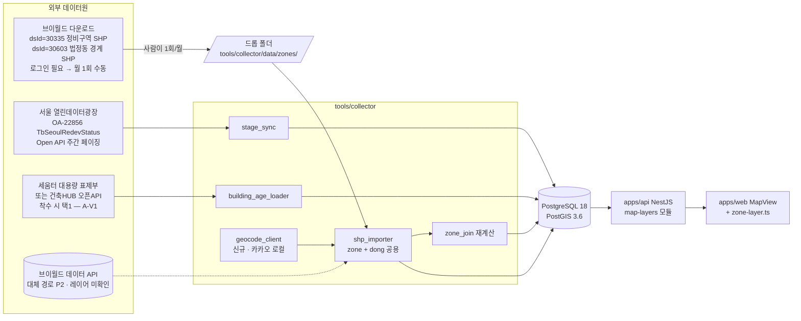
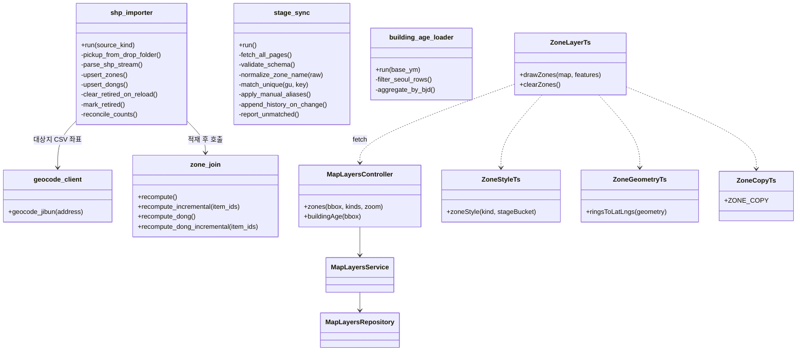
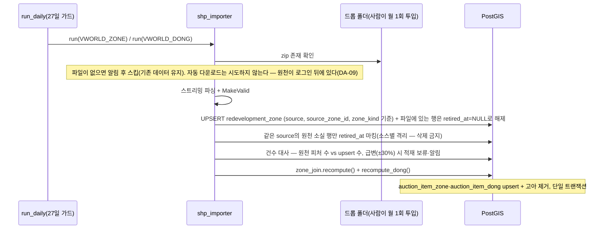
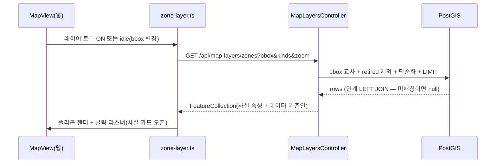
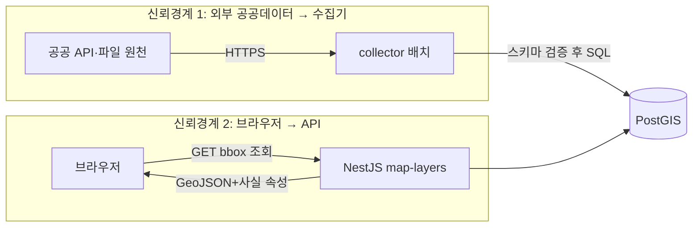

# 아키텍처 — 정비구역·모아타운·노후도 지도 레이어

## Context & Scope

pnpm 모노레포에 이미 가동 중인 3계층(tools/collector Python 배치 → PostgreSQL 18+PostGIS 3.6 →
apps/api NestJS → apps/web Next.js 16)에 새 실행 파일·새 인프라 없이 얹는다. auction_item.geom
(Point,4326)+GIST 인덱스가 기존재. DB 스키마 소유자는 collector(마이그레이션 017_부터, 추적 테이블
없이 매 실행 전량 재실행되므로 멱등 필수). 웹 지도는 apps/web/app/items/map/ 모듈(naver.maps 직접
호출 + 모듈 내 유틸 파일 분리 관례 — cluster.ts, usage-category.ts).

## Goals / Non-goals

- Goals: PRD FR-001~012 (P0·P1). 서울 한정. 무인 갱신. 사실만 표시(D-011).
- Non-goals: 모바일 렌더(후속 WP), 외부 API의 브라우저 직접 호출, 판단 표기, 실시간성(일·주 단위면 충분), 기존 마커·클러스터 로직 수정.

## 설계

### 시스템 컨텍스트

### 구현 접근 (난점 → 선택)

| 난점 | 선택 | 근거 |
|---|---|---|
| 폴리곤 페이로드(서울 전역 수백 구역, 원본 수 MB) | 서버측 bbox 필터 + ST_SimplifyPreserveTopology(줌 구간별 허용오차 초기값: z 12 이하 0.0005 / z 13~14 0.0002 / z 15 이상 0.00005) + GeoJSON 응답. 정밀 원본은 DB에만 | SC-003(512KB·p95 500ms). 허용오차는 구현 시 실측 보정 — 기준(SC)만 고정 |
| SHP(EPSG:5186) 적재 | Python **pyshp**(순수 파이썬, `pyproject.toml`에 **신규 의존성 추가 필요** — 현재 런타임 의존성은 `psycopg[binary]`·`pyproj` 둘뿐) → WKT → `ST_GeomFromText(...,5186)` → `ST_Transform(...,4326)` → `ST_MakeValid`. **좌표변환은 PostGIS 한 곳에서만** 한다 — pyproj는 기존 KATEC 경로(`geo.py`) 전용으로 두고 신규 SHP 경로에서는 쓰지 않는다(변환 지점이 둘이면 어긋났을 때 어느 쪽이 맞는지 알 수 없다) | GDAL 바이너리 의존 회피(Windows 배치 환경). 유효성 깨진 폴리곤은 MakeValid 후 적재, 실패 건은 건너뛰지 않고 로그+카운트(행 조용히 버리기 금지 — collector 관례) |
| 폴리곤 파일 취득이 로그인 뒤에 있음 | **드롭 폴더 우선** — `tools/collector/data/zones/`에 `LSMD_CONT_UD602_5174_서울.zip` / `LSMD_ADM_SECT_UMD_서울.zip`이 있으면 적재, 없으면 알림 후 스킵(기존 데이터 유지). 자동 다운로드는 시도하지 않는다 | 원천이 세션 인증을 요구한다(DA-09 실측). 세션 쿠키를 흉내 내는 경로는 D-007 취지와 충돌해 채택하지 않음 |
| 정비구역 SHP와 법정동 SHP가 사실상 같은 작업 | **임포터 1개(`shp_importer`)에 `source_kind` 파라미터**로 처리. 취득 경로·좌표계·라이선스·파일 구조가 동일하므로 두 모듈로 나누면 중복 | 규칙 14(과한 추상화 금지)와 규칙 4(작은 책임)의 절충 — 분기 1개짜리 파라미터가 모듈 복제보다 싸다 |
| 구역명 표기 불일치(단계 조인) | §3.4 정규화 + 유일해 매칭 + 수동 별칭 | DA-04 |
| 웹 렌더가 naver.maps 직접 호출인 현실 vs D-010 어댑터 규칙 | map 모듈 내 zone-layer.ts 유틸 1파일에 지도 SDK 접점을 격리(cluster.ts와 같은 패턴). MapView는 데이터 취득·상태만 담당 | 전면 어댑터 도입은 리팩토링 금지(규칙 15)와 충돌 — 격리로 D-010의 의도(교체 비용 국소화)만 지킨다. 기존 구조 최대 유지(규칙 1·22) |
| **`naver-maps.d.ts`에 Polygon이 없다(08 m-13)** | 이 파일을 **확장한다**: ① `class Polygon`(`setMap`·`setOptions`·`getPaths`) ② `interface PolygonOptions` — `paths`, `strokeWeight`, `strokeOpacity`, `strokeColor`, `strokeStyle`, `fillColor`, `fillOpacity`, `clickable`, `visible`, `zIndex`, `map` ③ `strokeStyle`은 리터럴 유니온(`'solid' \| 'shortdash' \| 'shortdot' \| 'shortdashdot' \| 'shortdashdotdot' \| 'dot' \| 'dash' \| 'longdash' \| 'dashdot' \| 'longdashdot' \| 'longdashdotdot'`) ④ `Event.addListener`의 target 유니온을 `Map \| Marker`에서 **`Map \| Marker \| Polygon`**으로 넓힌다 | 실측: 현 d.ts는 LatLng/LatLngBounds/Point/MarkerIcon/MapOptions/Map/MarkerOptions/Marker/Projection/Event만 선언하고 **Polygon이 없어 폴리곤 클릭 리스너가 strict에서 컴파일되지 않는다.** 옵션 이름·`strokeStyle` 허용값은 네이버 공식 레퍼런스로 확인(https://navermaps.github.io/maps.js.ncp/docs/naver.maps.Polygon.html , 2026-08-19). 파일 헤더 원칙("실사용 API 표면만 최소로 선언")을 그대로 지켜 **쓰는 것만** 추가한다 |
| **웹 테스트가 현 하네스에서 컴파일 불가(08 M-5)** | **컴포넌트를 렌더하지 않는다.** 검증해야 할 것을 순수 함수 3개로 뽑아 그것만 테스트한다: `zone-copy.ts`(문구 상수) · `zone-style.ts`(kind·stage → 스타일 객체, DA-10 표) · `zone-geometry.ts`(GeoJSON 링 → LatLng 배열). `zone-layer.ts`는 이 셋을 조립해 SDK를 호출하기만 하고, DOM 검증은 E2E(수동 Playwright)로 넘긴다 | 실측: `apps/web/tsconfig.test.json`은 `tsconfig.base.json`만 extends해 **`jsx` 옵션도 `lib: dom`도 없고**, devDependencies에 testing-library·jsdom이 없으며, 기존 14개 테스트가 **전부 순수 함수 테스트**다(컴포넌트 렌더 선례 0건). 하네스를 확장하면 이번 기능 때문에 저장소 테스트 정책이 바뀐다 — 규칙 14·15 위반. 세 파일이 전부 `app/items/map/` 아래라 `package.json`의 기존 글롭에 자동 포함된다(글롭 수정 불필요) |
| 사실 컬럼의 재사용(목록·백테스트·모바일) | 조인 결과를 뷰가 아닌 물리 테이블 auction_item_zone로 + computed_at 보존 | DA-01. 백테스트가 과거 시점 재현 가능 |
| 대상지(미고시) 좌표 | **신규 모듈 `tools/collector/src/collector/geocode_client.py`를 작성한다.** 시드 CSV의 대표지번 → 카카오 로컬 주소검색 API → 실패 시 좌표 NULL + 로그 | **"기존 관례 재사용"이 아니다(08 M-6 정정).** 실측: `geo.py`는 법원이 주는 KATEC 평면좌표를 pyproj로 WGS84 변환할 뿐이고, 리포 전체에 주소 지오코딩 호출이 0건이다. `KAKAO_REST_API_KEY`는 `.env.example:36`에 선언만 되어 있고 **어떤 코드도 쓰지 않는다**(카카오 OAuth는 `KAKAO_OAUTH_CLIENT_ID`를 쓰며, 카카오는 앱당 REST 키가 1개라 값은 같다). 즉 **신규 외부 연동 1건**이며 공수·리스크에 계상해야 한다 |
| 신규 지오코딩 클라이언트의 준수 사항 | ① HTTP는 stdlib `urllib`(수집기에 `requests`/`httpx` 의존성이 없다 — 실측) ② 재시도 대기는 기존 `backoff.py`의 `backoff_delay_ms(attempt)` 재사용(순수 함수라 sleep은 호출자가) ③ `COLLECTOR_REQUEST_INTERVAL_MS` 간격 준수 ④ 응답은 **명시 스키마 검증 후** 사용(규칙 21의 Python판) ⑤ 4xx 반복이면 우회 없이 중단·알림(D-007) ⑥ 로그에 키 마스킹 | 기존 `court_client.py`와 같은 형태를 따른다. 목킹 대상(TS-31)은 이 모듈 |

### 컴포넌트 구조

### 데이터 흐름 1 — 월간 폴리곤 적재·조인

### 데이터 흐름 2 — 지도 조회

### 3.4 단계 동기화 상세 (정정 2 — 실동작 수준 · **원천 교체 반영 2026-08-19, DA-04R**)

> **원천 교체 고지**: 초판이 쓴 OA-2253은 종료된 서비스다. 대체 원천 **OA-22856 /
> `TbSeoulRedevStatus`도 같은 `openapi.seoul.go.kr:8088` 표준 Open API**라서, 아래 구조
> (주간 전량 페이징 → 스키마 검증 → 정규화 → 유일해 매칭 → 이력 append)는 **그대로 유지**된다.
> 바뀐 것은 서비스명·필드명·원천 갱신주기(분기)·전송 프로토콜(HTTP 평문) 네 가지다.

**주기·트리거**: run_daily 파이프라인 마지막에 stage_sync 단계를 추가한다. 내부 가드: sync_run
테이블의 마지막 성공 시각이 **6일** 이내면 스킵 — 일간 실행에 편승하는 주간 배치라 별도 스케줄러가
필요 없다(**가드는 6일로 통일한다 — 08 m-04**). run_daily의 "Docker·DB 선기동" 순서는 그대로 준수.
폴리곤·법정동 적재(shp_importer)는 같은 방식으로 27일 가드(월간), 노후도(building_age_loader)도
27일 가드. **zone_join은 두 곳에서 불린다(GATE 반영)**: 월간 폴리곤 적재 직후 전체 재계산 +
run_daily 물건 적재 직후 신규·좌표 변경 물건 증분(recompute_incremental) — 물건은 매일 유입되므로
조인을 월간에만 묶으면 신규 공고 물건의 구역 사실이 최대 4주 공백이 된다. 법정동 조인
(`recompute_dong` / `recompute_dong_incremental`)도 같은 두 트리거를 탄다.

**주간 배치인데 원천은 분기 갱신인 이유**: 원천 갱신 시점이 공표되지 않아 폴링 외에 알 방법이
없다. 주간 실행은 "언제 바뀌었는지 최대 1주 안에 알아차리기" 위한 것이고, **표시되는 단계 값
자체는 원천이 분기 갱신이라 최대 1분기 뒤처질 수 있다**. 이 지연은 숨기지 않고 화면의 원천
기준일로 그대로 전달한다(07 SLO 참조).

**수집**: `http://openapi.seoul.go.kr:8088/{SEOUL_OPEN_DATA_API_KEY}/json/TbSeoulRedevStatus/{start}/{end}/`
형식, **1000행 페이지네이션**(`ERROR-336`이 그 이상을 거부) 전량 조회. 실측 총 행 수 472(2026-08-19)
이므로 정상 상황에서 페이지는 1개지만, 원천 증가에 대비해 `list_total_count`를 읽고 루프를 돈다.
HTTP는 stdlib `urllib`(수집기에 HTTP 라이브러리 의존성이 없다 — 실측). D-007 예절:
`COLLECTOR_REQUEST_INTERVAL_MS` 간격 준수, 실패 시 `backoff.py`의 `backoff_delay_ms(attempt)`로
지수 백오프, 4xx 반복이면 우회 없이 중단·알림.

**전송 보안(신규)**: 이 엔드포인트는 **TLS를 받지 않는다** — 443 무응답, 8088에 TLS로 붙으면
`wrong version number`(실측 2026-08-19). 인증키가 평문 URL 경로에 실려 나간다. 대응은 위협모델
③의 "API 키 평문 전송" 행 참조(요약: 키는 무료·읽기전용·재발급 가능이므로 Accept + 로그 마스킹).

**스키마 검증**: 필수 필드 **`DISTRICT`(자치구) · `ZONE_NM`(구역명) · `BIZ_TYPE`(사업유형) ·
`BIZ_STAGE`(사업추진단계)** 의 존재·타입을 명시 검증하고, `RESULT.CODE == "INFO-000"`과
`list_total_count`도 함께 검사한다(외부 입력 런타임 검증 — 규칙 21의 Python판). 검증 실패 →
전체 롤백·알림·기존 데이터 유지 (엣지 B-2). 부분 적재는 하지 않는다 — 단계 데이터가 반쯤 섞이면
어느 행이 최신인지 알 수 없게 된다. 보조 필드로 `JIBUN_ADDR`(지번주소)와 단계별 인가일 8종
(`ZONE_DESIGNATION_INIT_YMD`·`PROMOTION_COMMITTEE_YMD`·`ASSOCIATION_ESTABLISHMENT_YMD`·
`ARCHITECTURAL_REVIEW_YMD`·`BIZ_IMPLEMENTATION_INIT_YMD`/`_LAST_YMD`·`MGMT_DISPOSITION_INIT_YMD`/
`_LAST_YMD`)을 원문 보존한다 — 고시일 표기와 단계 사전 교차검증에 쓴다.

**단계 버킷 사전**: `BIZ_STAGE` 원문 → DA-10의 4개 버킷(구역지정/추진위 · 조합설립 · 사업시행인가 ·
관리처분인가 이후) 매핑은 **코드 안의 명시 dict**로 둔다. **사전에 없는 값은 예외 없이 "단계 미확인"
버킷**으로 떨어지고 `stage_match_report`에 원문이 남는다 — 모르는 값을 가까운 버킷에 밀어 넣는 순간
허위 사실이 된다. 사전의 초기 항목은 관측된 `추진위`·`구역지정`·`조합설립` 셋뿐이며, **전체 값
목록은 미확인(A-V2)** 이다. 착수 첫 실행에서 `DISTINCT BIZ_STAGE`를 리포트로 뽑아 사전을 채운다.

**정규화 규칙** normalize_zone_name — 순서 고정:
1. NFKC 정규화, 모든 공백 제거, 가운뎃점·하이픈 제거
2. 괄호와 내용 제거: (가칭), (변경), (구역계 변경) 류
3. "제N" → "N" (제10구역 → 10구역), 한자 숫자 발견 시 아라비아 변환
4. 사업유형 접미사 제거(긴 것부터): 주택재개발정비사업 / 재개발정비사업 / 재건축정비사업 /
   도시환경정비사업 / 재정비촉진 / 정비사업 / 정비구역 / 사업 / 구역
5. 결과가 빈 문자열이면 정규화 실패 — 원문 유지·미매칭 경로로

규칙은 실데이터로 검증한다: 첫 동기화 때 양쪽 원천의 전체 이름 쌍 덤프를 리포트로 뽑아 규칙
누락(촉진지구 세부구역 번호 표기 등)을 보정한다. 규칙 추가는 코드+pytest 케이스로만.

**매칭** — 키 = (자치구 정규화, normalize된 구역명). 우선순위:
1. zone_alias 수동 별칭 일치 — 키 (자치구, 원문). 자동 키와 같은 자치구 스코프를 써서 교차
   자치구 오귀속을 차단한다(GATE 반영) → 채택 (match_method = MANUAL)
2. 자동 키 일치가 정확히 1:1 → 채택 (match_method = AUTO)
3. 0건 또는 2건 이상 → 미매칭: 단계를 저장하지 않고(화면 "단계 미확인") stage_match_report에
   원문·정규화키·후보 목록 기록. 편집거리 2 이하 퍼지 유사도는 리포트의 후보 제안에만 사용 —
   자동 채택 금지(허위 단계가 공백 단계보다 나쁘다).

**수동 보정 보존**: 동기화는 매 실행 시 zone_stage_match 행 전체를 재계산하되, zone_alias(사람
입력)는 절대 수정·삭제하지 않는다 — MANUAL 매치는 alias에서 매번 재파생되므로 자동 재계산이 덮을
수 없다(GATE 반영: "읽기만 한다"의 모호성 제거). 별칭 등록은 zone_alias(zone_id, gu,
source_name_raw) insert 1건 — 다음 동기화부터 반영.

**이력·멱등**: 단계는 zone_stage_history에 **최신 행과 다를 때만** append한다 — 같은 트랜잭션에서
해당 구역의 최신 행을 조회해 비교하므로 같은 실행을 연달아 돌려도 삽입 0건. A→B→A 재진입(정정·
해제 후 재지정)은 정당한 이력이므로 허용한다 — 전 구간 UNIQUE 제약은 두지 않는다(재진입 이력을
DB가 거부하는 모순 방지, GATE 반영). 현재값 비정규화 캐시
redevelopment_zone.current_stage는 같은 트랜잭션에서 갱신. 같은 실행을 연달아 돌려도 행 수·값이
불변(엣지 B-4, SC-006). 실행 기록은 sync_run(job, started_at, finished_at, status, counts jsonb).

### 데이터 저장 (설계 결정 관련만 — 전체 스키마는 05)

- 폴리곤 원본 정밀도를 DB에 보존하고 단순화는 조회 시 수행 — 단순화 결과를 저장하면 줌 정책
  변경마다 재적재가 필요해진다. 성능 문제가 실측되면 그때 사전 단순화 컬럼을 추가한다(규칙 14).
- auction_item_zone은 (auction_item, zone) 복합 유니크 — 다구역 겹침(엣지 A-1)이 자연 표현된다.
- **`retired_at` 해제 규칙(08 m-03)**: upsert는 "이번 파일에 존재하는 행"의 `retired_at`을 **NULL로
  되돌린다.** 이 규칙이 없으면 07의 오염 복구 절차(전체 retired 마킹 후 재적재)가 전 구역을 영구
  retired 상태로 만든다. 규칙 본문은 05 데이터 규칙에 명문화한다.
- **법정동 조인(FR-017 · 08 M-1)**: `auction_item`에는 법정동 코드 컬럼이 없다(실측: `001_auction_collector.sql`의
  컬럼은 id·auction_case_id·item_no·usage_code·address·appraisal_amount·minimum_sale_price·
  failed_bid_count·geom·created_at·updated_at뿐이고, 전 마이그레이션에서 `bjd` 문자열 0건).
  그래서 조인 키를 **주소 파싱이 아니라 공간 조인으로 만든다**: `bjd_dong` 테이블(법정동 경계
  MultiPolygon)에 대해 `ST_Contains(dong.geom, item.geom)`을 계산해 `auction_item_dong`에 저장한다.
  - 주소 파싱을 기각한 이유: 법원 주소 문자열의 표기 편차에 대한 **실패율을 측정한 적이 없고**,
    측정하려면 결국 정답셋이 필요한데 그 정답셋이 곧 공간 조인 결과다. 측정 없이 파싱을 쓰면
    "모르는 실패율"이 P1 요구사항 밑에 깔린다.
  - 경계선 위 물건: `ST_Contains`는 경계를 포함하지 않으므로 어느 동에도 안 붙을 수 있다.
    이 경우 행을 만들지 않고(노후도 문장 생략) 카운트만 로그에 남긴다 — 물건×구역 조인이
    `ST_Intersects`(포함)인 것과 기준이 다른 점은 05 API 문서에 명시한다. 동은 배타적 분할이라
    포함 기준을 쓰면 한 물건이 두 동에 속하는 모순이 생긴다.
  - geom NULL 물건은 조인 대상 제외(엣지 A-2와 동일 취급).
- 노후도는 집계 결과만 저장(건물 원시 행 미보존 — 월간 파일에서 재계산 가능). 기준연월 base_ym을
  행에 남겨 "언제 기준인지"를 화면까지 운반한다. 세움터 원본에서 필요 컬럼만 선별 적재하고
  소유자 관련 필드는 파일에서 읽지도 않는다(D-011a 취지).
- **대상지→지정 승격(GATE 반영)**: 관리지역 SHP 적재 시 (자치구, 정규화 명칭)이 일치하는
  MOATOWN_CANDIDATE(시드 유래) 행을 retired_at 처리한다 — 같은 구역이 마커와 폴리곤으로 이중
  표시되는 경로 차단. mark_retired의 일반 규칙은 항상 같은 source 안에서만 동작하고, 이 승격
  처리만 명시적 교차 소스 규칙으로 둔다.

## 검토한 대안

| 대안 | 트레이드오프 | 결론 |
|---|---|---|
| 정적 zones.geojson + 프론트 렌더(지시서 원안) | 구현 최소·의존성 0 vs 사실 재사용 불가·페이로드 통제 불가·갱신=재배포 | 기각 (DA-01, 사용자 결정) |
| 브이월드 **데이터 API** 직결 적재 | 자동화 최용이 vs **정비구역 레이어 ID 자체가 미확인**(지시서의 `LT_C_UPISUQ153`은 도시계획(공간시설)로 판명 — 다른 레이어다)·ND 잔존 | 대체 경로 P2 (DA-03R2). 착수 전 A-V6로 확인하고, 확인되면 P0 취득 자동화가 함께 풀린다 |
| 브이월드 다운로드를 세션 쿠키로 자동화 | 완전 무인 vs 세션 만료·화면 개편에 취약, 로그인 우회 성격이라 D-007 취지와 충돌 | 기각 (DA-09 B안) |
| 단계 수동 STAGE 테이블(지시서 원안) | 통제감 vs 253건+월 단위 추적을 사람이 지속 불가 | 기각 (DA-04) |
| 벡터 타일(MVT) 서빙 | 대용량 확장성 vs 신규 인프라·복잡도 — 서울 수백 폴리곤엔 과함 | 기각 — bbox+단순화로 충분(규칙 14) |
| 상세 조회 시 실시간 ST_Intersects(사전계산 없이) | 저장 단순 vs 목록·백테스트 재사용 불가 | 기각 — 사용자 결정(사전계산) |

## 위협모델

### ① 무엇을 만드는가 — DFD + trust boundary

### ② 무엇이 잘못될 수 있는가 — STRIDE 전수 (6범주 × 경계)

| 자산/경계 | S | T | R | I | D | E |
|---|---|---|---|---|---|---|
| TB1 외부→수집기 | 유효 — 위장 원천(DNS 오염 등)이 가짜 폴리곤·단계 주입. **단계 원천이 평문 HTTP라 이 경로가 초판 판단보다 열려 있다** | **유효(상향)** — 초판은 "HTTPS로 차단"이라 적었으나 단계 API는 **HTTP 전용**(실측)이라 전송 중 변조가 실제로 가능하다. 폴리곤은 사람이 브라우저(HTTPS)로 받아 오므로 여기선 해당 없음 | 해당없음 — 공개 데이터에 원천 부인 개념 없음(적재 이력은 sync_run으로 추적) | 유효 — **API 키가 평문 HTTP URL 경로에 실린다**(TLS 없음, 실측). 로그 유출뿐 아니라 네트워크 경로 노출도 포함 | 유효 — 원천 다운·스로틀 | 해당없음 — 권한 개념 없는 공개 조회 |
| 수집기→DB | 해당없음 — 로컬 자격증명, 기존 체계 불변 | 유효 — 파싱 버그로 오염 적재 | 해당없음 — 단일 운영자 배치, sync_run 로그로 실행 추적 충분 | 해당없음 — 신규 데이터에 비밀·개인정보 없음 | 유효 — 대형 파일 전체 로드로 메모리 고갈 | 해당없음 — DB 계정 권한 변경 없음 |
| TB2 브라우저→API | 해당없음 — 인증 불요 공개 조회 엔드포인트 | 해당없음 — GET 전용, 서버 상태 변경 없음 | 해당없음 — 조회 행위 부인의 이해관계 없음 | 유효 — 내부 에러·스택 노출 경로 | 유효 — 초대형 bbox·고빈도 호출로 DB 부하 | 해당없음 — 권한 상승 대상(역할·관리 기능) 없음 |
| 화면 표시(웹) | 해당없음 — 렌더 단계에는 신원 주장이 없다(인증 UI·서명 표시가 없음) | 유효 — 구역명 등 외부 유래 문자열 XSS | 해당없음 — 브라우저 렌더는 감사 대상 행위가 아니고 남길 기록도 없다(조회 로그는 API 계층 책임) | 해당없음 — 화면에 뿌리는 값이 이미 공개 데이터이고, 응답에 개인정보·내부 식별자가 없다(05 응답 필드 전수 확인) | 해당없음 — 클라이언트 자원 고갈은 피처 상한(EP-1)과 단순화로 이미 상한이 걸려 있어 별도 위협으로 세지 않는다 | 해당없음 — 이 화면에 권한·역할 개념이 없다(공개 지도, 로그인 무관) |

### ③ 무엇을 할 것인가

| 위협 | 대응 | 대책 |
|---|---|---|
| 가짜 원천 주입 | Mitigate | 공식 도메인 고정 + TLS 인증서 검증 기본값 유지(verify 비활성 금지) + 건수·총면적 급변(±30%) 시 적재 보류·알림 |
| 오염 적재 | Mitigate | 명시 스키마 검증, ST_MakeValid, 단일 트랜잭션 적재, 건수 대사(FR-001·003) |
| 원천 다운·스로틀 | Mitigate+Accept | 백오프·중단·알림(D-007), 기존 적재분으로 계속 서빙 + 화면에 기준일 표기. 장기 중단 자체는 Accept — 공공 원천 SLA는 통제 밖 |
| API 키 평문 전송·URL 노출 | Mitigate + Accept | ① 로그 기록 전 키를 `{KEY}`로 치환(규칙 8 관례) ② `.env`에만 보관, 커밋 금지 ③ **평문 전송 자체는 Accept** — 원천이 TLS를 제공하지 않아 통제 밖이고, 이 키는 **무료·즉시 발급·읽기 전용 공개 데이터용**이라 유출 피해가 "제3자가 같은 공개 데이터를 조회"에 그친다. 유출 정황 시 재발급 ④ 대안(프록시·VPN)은 규칙 14 기준 과잉 |
| 평문 HTTP 응답 변조로 가짜 단계 주입 | Mitigate | 스키마 검증 + **유일해 매칭**(모르는 이름은 매칭 안 함) + 사전에 없는 `BIZ_STAGE`는 미확인 강등 + 건수 대사(직전 실행 대비 ±30% 급변 시 보류). 즉 변조가 통과하려면 "실재 구역명 × 사전에 있는 단계값 × 건수 유지"를 동시에 만족해야 한다 |
| bbox 남용 DoS | Mitigate | envelope 면적 상한(서울 전역의 약 2배 초과 시 400) + 피처 수 LIMIT + 단순화. 레이트리밋은 기존 API 정책에 편승 |
| 파싱 메모리 고갈 | Mitigate | SHP 레코드 스트리밍 파싱, 세움터 파일은 청크 단위 집계(전체 로드 금지) |
| 스택 노출 | Mitigate | 기존 NestJS 예외 처리 규약 준수 — 신규 예외를 그대로 흘리지 않음 |
| 구역명 XSS | Mitigate | 신규 렌더는 React JSX 텍스트 노드로만 출력. 기존 markerHtml식 innerHTML 문자열 조립을 신규 코드에 사용 금지 |

### ④ 충분한가 — 상위 리스크 3개 재검토

1. **허위 사실 표시**(잘못된 단계·경계) — 이 제품 최대 리스크(보안이 아니라 정합성). 3중 방어:
   유일해 매칭(추측 금지) · 건수 대사 · 기준일 상시 표기. 잔여: 원천 자체의 오류는 탐지 불가 —
   Accept(출처·기준일 표기로 책임 소재를 사실대로 전달).
2. bbox DoS — 상한+LIMIT 후 잔여 낮음. 공개 서비스화 시점에 레이트리밋 재평가(DA-06 체크리스트).
3. XSS — 신규 코드는 JSX 텍스트 노드 원칙으로 차단. **초판이 잔여 리스크로 적었던 "기존 markerHtml도
   외부 문자열을 innerHTML로 조립한다"는 사실이 아니어서 삭제한다(08 m-05).** 실측: `MapView.tsx`의
   마커 HTML은 `usageCategory()`가 반환하는 **닫힌 enum**으로 아이콘·클래스를 고르고, 삽입되는 값은
   포맷된 숫자와 건수뿐이다. 존재하지 않는 리스크를 후속 점검 항목으로 남기면 진짜 항목이 묻힌다.

## Cross-cutting

- **관측성**: 배치별 구조화 로그(원천 건수·upsert·retired·미매칭·제외 건수·소요시간) + sync_run
  테이블. API는 기존 NestJS 로깅 규약. 상세 지표·알림은 07.
- **프라이버시**: 신규 데이터에 개인정보 없음. 세움터 표제부의 소유자 관련 필드는 적재 자체를
  하지 않는다. D-011a(개인정보 분리)·주민번호 필드 금지 원칙에 영향 없음.
