# API 계약 & 데이터 스키마 — 정비구역·모아타운·노후도 지도 레이어

## 규약 (기존 저장소 관례 우선 — 규칙 1·12)

- 이 저장소의 기존 API는 GET+쿼리 파라미터, 플레인 JSON을 쓴다. **전역 ValidationPipe는
  실재한다**(`apps/api/src/main.ts:16-18`, `{ whitelist: true, forbidNonWhitelisted: true,
  transform: true }`). 다만 **auction-items bbox는 그 선례가 아니다(08 m-06 정정)** — bbox는 raw
  `@Query('minLng') minLng?: string` 4개를 받아 `parseBboxParam`으로 수동 파싱하고,
  `dto/bbox.dto.ts`는 데코레이터 없는 순수 interface라 파이프가 관여하지 않는다. **신규
  엔드포인트는 class-validator DTO를 써서 전역 파이프를 실제로 태우는 첫 사례가 된다**(규칙 21).
- **경로 표기 규칙(08 m-01)**: 이 저장소에 **글로벌 프리픽스가 없다**(`setGlobalPrefix` 미사용,
  `@Controller('auction-items')`). 브라우저가 보는 `/api/...`는 `apps/web/next.config.ts`의
  rewrite(`/api/:path*` → `${API_BASE_URL}/:path*`)일 뿐이다. 그래서 아래 표는 **브라우저 경로**와
  **컨트롤러 경로**를 나눠 적는다. `@Controller('api/map-layers')`로 만들면 브라우저에서
  `/api/api/...`가 된다.
- 템플릿 표준(RFC 9457 Problem JSON, 커서 페이지네이션, Idempotency-Key)은 **이번 범위에서 해당
  없음** — 전 엔드포인트가 부작용 없는 GET이고 페이지네이션 대신 bbox+LIMIT를 쓴다. 에러는 기존
  NestJS 기본 포맷(statusCode/message)을 유지하되 내부 스택 비노출.
- 버저닝: URL 버저닝 없음. 기존 응답에는 **필드 추가만** 허용(하위 호환 — 규칙 12). 필드 제거·의미
  변경 금지.
- DTO: 쿼리 DTO는 class-validator, 수집기의 외부 응답 검증은 명시 스키마 검증(규칙 21).
  웹은 기존 bbox fetch 선례 수준의 형태 확인.
- 좌표: 경도 lng, 위도 lat, SRID 4326. GeoJSON은 [lng, lat] 순서(표준 그대로 — 네이버 LatLng
  변환은 zone-layer.ts 책임).

## 엔드포인트 표

| ID | 브라우저 경로 | 컨트롤러 경로 (`@Controller` + 메서드) | 요청(핵심) | 응답 | 주요 에러 | 비고 |
|---|---|---|---|---|---|---|
| EP-1 | `GET /api/map-layers/zones` | `@Controller('map-layers')` + `@Get('zones')` | minLng·minLat·maxLng·maxLat(필수, number) / kinds(선택, CSV: REDEV·MOATOWN_DESIGNATED·MOATOWN_CANDIDATE, 기본 전체) / zoom(선택, int 6~21, 기본 12) — **class-validator DTO** | GeoJSON FeatureCollection. Feature.properties = zoneId, zoneName, zoneKind, businessKind(사업유형 원문 `BIZ_TYPE`), stage(**REDEV 전용**: string 또는 null — null이면 화면 "단계 미확인". MOATOWN_* 피처에는 stage 키를 내리지 않는다), stageBucket(**REDEV 전용**: DA-10의 5개 버킷 중 하나 — 웹은 색이 아니라 이 값으로 스타일을 고른다), stageNoticeDate(date 또는 null), designatedAt, sourceName, sourceUpdatedAt. MOATOWN_CANDIDATE는 geometry가 Point(대표지번) + properties.boundaryStatus="PRE_NOTICE" | 400 bbox 결측·역전·면적 상한 초과(서울 전역 약 2배) / 400 kinds·zoom 형식 오류 | **피처 상한 = 설정 상수 `ZONE_FEATURE_LIMIT`, 기본 1000**(상한 근거는 아래 별항). 초과 시 truncated=true를 FC 루트에 — 웹은 FR-005의 사실 안내 표시. `ST_SimplifyPreserveTopology`(zoom 구간별) + **`ST_AsGeoJSON(geom, 6)`** — 소수점 6자리 고정(약 0.1 m, 08 m-14) |
| EP-2 | `GET /api/auction-items/bbox` (기존 확장) | `@Controller('auction-items')` + `@Get('bbox')` (기존) | 기존 동일 | 핀 객체에 zoneKinds: string[] 추가(비어 있으면 []) | 기존 동일 | FR-012. 하위 호환: 추가 필드만. **목록 `GET /auction-items`는 확장하지 않는다**(08 m-15) |
| EP-3 | `GET /api/auction-items/:courtOfficeCode/:caseNo/:itemNo/zone-facts` (**신규 서브리소스**) | `@Controller('auction-items')` + `@Get(':courtOfficeCode/:caseNo/:itemNo/zone-facts')` | 경로 파라미터 3개 | `{ zoneFacts: [{zoneId, zoneName, zoneKind, businessKind, stage(null 허용), stageBucket, stageNoticeDate, sourceName, sourceUpdatedAt}] 또는 null, dongBuildingAge: {bjdCode, bjdName, over20Ratio, over30Ratio, totalCount, baseYm} 또는 null }` | 404 물건 없음 | **FR-006·010. 기존 상세 응답은 건드리지 않는다.** 이유(08 M-4 실측): 지도 패널 `ItemDetailPanel.tsx`는 bbox 응답을 props로 받고 `/photos`·`/notice-analysis`·`/affordability` **서브리소스만** 추가 fetch한다 — 기본 상세 리소스를 호출하는 것은 서버 렌더 상세 페이지뿐이다. 서브리소스로 만들어야 두 화면이 같은 경로를 쓴다. geom NULL 물건은 `zoneFacts: null`(빈 배열 아님 — "구역 밖" 오독 방지, 엣지 A-2) |
| EP-4 | `GET /api/map-layers/building-age` | `@Controller('map-layers')` + `@Get('building-age')` | bbox 동일 | 법정동 코로플레스 FeatureCollection(over20Ratio·over30Ratio·baseYm) | 400 동일 | **P2** — 경계 데이터 자체는 FR-017로 P1에 들어오지만, 코로플레스 렌더(FR-014)는 P2 유지. MVP에서는 미구현·미노출 |

**라우트 선언 순서 주의**: `auction-items.controller.ts:53`에 "상세 라우트(`:courtOfficeCode/:caseNo/:itemNo`)보다
먼저 선언해야 한다 — NestJS는 선언 순서로 매칭한다"는 주석이 있다. EP-3은 세그먼트가 4개라 3세그먼트
상세와 충돌하지 않지만, 기존 `/photos`·`/notice-analysis`와 **같은 위치에 나란히** 선언한다.

**`ZONE_FEATURE_LIMIT` 상한 근거 (08 M-7·m-04 재산정)** — 초판의 600은 "253+85+132≈470"에서 나왔고
그중 85가 허수였다. 다시 세운 기준은 이렇다.

| 항목 | 값 | 출처 |
|---|---|---|
| 정비사업 단계 원천 행 수 | **472** | `TbSeoulRedevStatus.list_total_count` 실측 2026-08-19 |
| 모아타운 대상지 | **132** | 서울시 추진현황 2026-03 기준 |
| 모아타운 지정 구역 | **미확인** | 공식 집계 없음(DA-05R). MVP 적재 0건 |
| 서울 정비구역 **폴리곤 피처 수** | **미확인** | SHP를 아직 못 받았다. 단계 행 수와 1:1이 아닐 수 있다(해제·완료 구역 포함 여부 미상) |

→ 확인된 하한은 604. 상한은 **1000**으로 두되, 이것은 **DoS 가드일 뿐 1차 게이트가 아니다** —
1차 게이트는 SC-003의 **응답 512KB**이고 그 통제 수단은 단순화 허용오차와 좌표 정밀도다.
**착수 후 최초 적재가 끝나면 `SELECT count(*) FROM redevelopment_zone WHERE retired_at IS NULL`로
실수치를 재고, 상한을 그 값의 1.5배로 확정한다.** 줌 12 서울 전역에서 truncated가 상시 켜지면
설계 오류다(그 상황을 TS-39가 아니라 TS-20이 잡는다).

## OpenAPI 스케치 (핵심 EP-1만 — 전문은 구현 단계)

```yaml
# 컨트롤러 경로 기준(브라우저에서는 /api 프리픽스가 붙는다 — 위 표 참조)
paths:
  /map-layers/zones:
    get:
      parameters:
        - { name: minLng, in: query, required: true, schema: { type: number } }
        - { name: minLat, in: query, required: true, schema: { type: number } }
        - { name: maxLng, in: query, required: true, schema: { type: number } }
        - { name: maxLat, in: query, required: true, schema: { type: number } }
        - { name: kinds, in: query, schema: { type: string, example: "REDEV,MOATOWN_DESIGNATED" } }
        - { name: zoom, in: query, schema: { type: integer, minimum: 6, maximum: 21 } }
      responses:
        "200":
          content:
            application/json:
              schema:
                type: object
                properties:
                  type: { const: FeatureCollection }
                  truncated: { type: boolean }
                  features: { type: array }
        "400": { description: bbox·파라미터 오류 }
```

## ERD (마이그레이션 017_ — 신규 테이블만·기존 테이블 변경 없음. 전부 멱등 DDL: CREATE TABLE IF NOT EXISTS 계열)

```mermaid
erDiagram
  redevelopment_zone {
    bigint id PK
    text source "VWORLD_DL | SEOUL_SEED | PARCEL_UNION | VWORLD_API"
    text source_zone_id "원천 식별자(시드는 생성 규칙)"
    text zone_kind "REDEV | MOATOWN_DESIGNATED | MOATOWN_CANDIDATE"
    text zone_name
    text sigungu
    text business_kind "사업구분 원문(재개발·재건축 등)"
    geometry geom "MultiPolygon 4326, 대상지는 NULL"
    geometry rep_point "Point 4326, 지오코딩 실패 시 NULL"
    numeric area_m2
    text current_stage "비정규화 캐시, 미매칭 NULL"
    date current_stage_notice_date
    date designated_at
    timestamptz retired_at "원천 소실 시 마킹, 삭제 금지"
    timestamptz source_updated_at
    timestamptz collected_at
  }
  zone_stage_source {
    bigint id PK
    text gu
    text zone_name_raw
    text business_kind
    text stage_raw
    date notice_date
    timestamptz observed_at
    jsonb raw
  }
  zone_stage_match {
    bigint zone_id FK
    bigint stage_source_id FK
    text match_method "AUTO | MANUAL"
    timestamptz matched_at
  }
  zone_alias {
    bigint id PK
    bigint zone_id FK
    text gu "NOT NULL — 자동 매칭과 동일한 자치구 스코프(GATE 반영). NULL이면 UNIQUE가 무력화되고 그 별칭은 영원히 매칭되지 않는다(07 RB-3)"
    text source_name_raw "UNIQUE(gu, source_name_raw)"
    timestamptz created_at
  }
  zone_stage_history {
    bigint id PK
    bigint zone_id FK
    text stage_norm
    date notice_date
    timestamptz observed_at
  }
  stage_match_report {
    bigint id PK
    bigint sync_run_id FK
    text zone_name_raw
    text normalized_key
    jsonb candidates
  }
  auction_item_zone {
    bigint auction_item_id FK
    bigint zone_id FK
    timestamptz computed_at
  }
  bjd_dong {
    text bjd_code PK "법정동 코드 — 자릿수는 SHP 실취득 후 확정(미확인, A-V3)"
    text dong_name
    text sigungu
    geometry geom "MultiPolygon 4326"
    timestamptz source_updated_at
    timestamptz collected_at
  }
  auction_item_dong {
    bigint auction_item_id PK
    text bjd_code FK
    timestamptz computed_at
  }
  building_age_dong {
    text bjd_code PK "PK(bjd_code+base_ym). 자릿수는 표제부 원천과 법정동 SHP 양쪽을 실측한 뒤 확정한다 — 미확인(A-V1·A-V3)"
    text base_ym PK
    text dong_name
    int total_count "사용승인일 있는 건물 수(분모)"
    int unknown_apr_count "승인일 결측 — 분모 제외(엣지 C-3)"
    int over20_count
    int over30_count
    timestamptz loaded_at
  }
  sync_run {
    bigint id PK
    text job "shp_importer_zone | shp_importer_dong | stage_sync | building_age_loader | zone_join"
    timestamptz started_at
    timestamptz finished_at
    text status "SUCCESS | FAILED | SKIPPED"
    jsonb counts "원천·upsert·retired·미매칭 등"
  }
  redevelopment_zone ||--o{ auction_item_zone : "물건 겹침(복수 허용)"
  bjd_dong ||--o{ auction_item_dong : "물건 포함(정확히 0..1)"
  bjd_dong ||--o{ building_age_dong : "동별 노후도 집계"
  redevelopment_zone ||--o| zone_stage_match : "현재 매칭(0..1)"
  zone_stage_source ||--o{ zone_stage_match : ""
  redevelopment_zone ||--o{ zone_alias : "수동 별칭"
  redevelopment_zone ||--o{ zone_stage_history : "단계 변경 이력"
  sync_run ||--o{ stage_match_report : "실행별 리포트"
```



인덱스: redevelopment_zone.geom GIST / **bjd_dong.geom GIST** / auction_item_zone(auction_item_id) /
**auction_item_dong PK(auction_item_id) + (bjd_code) 인덱스** / UNIQUE(source, source_zone_id,
zone_kind) / **zone_stage_match UNIQUE(zone_id)** (0..1 카디널리티를 DB가 강제 — GATE 반영) /
zone_alias UNIQUE(gu, source_name_raw) / zone_stage_history는 전 구간 UNIQUE 없음(A→B→A 재진입 이력
허용, 04 §3.4) + (zone_id, observed_at) 조회 인덱스 / building_age_dong PK(bjd_code, base_ym).
소프트삭제: retired_at 방식(행 삭제 없음, source별 격리 + 대상지→지정 승격 규칙은 04 데이터 저장 참조).
`bjd_dong`은 행정구역 개편이 드물고 이력 요구가 없어 소프트삭제 없이 전량 교체(delete-insert가 아니라
upsert + 원천 소실 행 삭제)한다 — 폐지된 법정동을 남겨 두면 조인이 옛 경계를 계속 가리킨다.

## 데이터 규칙

- 비율은 저장하지 않고 분자·분모(count)를 저장, 비율은 조회 시 계산(반올림 정책을 API 한 곳에 고정
  — 소수점 1자리 %). 분모 0이면 null (0% 표기 금지, 엣지 C-2).
- 시각: timestamptz(UTC 저장), 고시일·기준연월은 date/text(YYYY-MM) — 시간 정보가 없는 원천 값에
  시간을 발명하지 않는다.
- 문자열 원문 보존: stage_raw·zone_name_raw는 원문 그대로 + 정규화 값은 별도 컬럼 — "셀 텍스트를
  증거로 남긴다"는 기존 수집기 원칙(커밋 8987987) 계승.
- 식별자: 물건은 기존 (court_office_code, case_no, item_no) 체계 유지, 구역은 (source,
  source_zone_id, zone_kind).
- **`retired_at` 해제 규칙 (08 m-03)**: `redevelopment_zone` upsert는 **이번 원천 파일에 존재하는
  모든 행의 `retired_at`을 NULL로 되돌린다.** 즉 `retired_at`은 "직전 적재에는 있었는데 이번
  적재에는 없는 행"에만 남는다. 이 규칙이 없으면 07의 오염 복구 절차(전체 retired 마킹 → 재적재)가
  전 구역을 영구 retired로 만들어 지도에서 사라지게 한다.
- **경계 포함 기준이 두 가지인 이유**: 물건×구역은 `ST_Intersects`(경계선 위 = 포함, 엣지 A-3),
  물건×법정동은 `ST_Contains`(경계선 위 = 미포함, 행 생성 안 함). 구역은 겹칠 수 있어 포함이
  안전하고, 법정동은 배타적 분할이라 포함 기준을 쓰면 한 물건이 두 동에 속하는 모순이 생긴다.
  두 기준 모두 EP-1·EP-3 문서에 명시한다.

## 커버리지 매핑 (P0·P1 100% — 매핑 0건 = 결함)

| FR | 담당 (마이그레이션 / 배치 / 엔드포인트 / UI) |
|---|---|
| FR-001 (P0) | 017_ 스키마 + collector `shp_importer(VWORLD_ZONE)` + 드롭 폴더 + sync_run 대사 로그 |
| FR-002 (P0) | zone_join.recompute() / recompute_incremental() + auction_item_zone |
| FR-003 (P0) | stage_sync(`TbSeoulRedevStatus`) + zone_stage_source/match/history + zone_alias 보존 규칙 |
| FR-004 (P0) | EP-1 |
| FR-005 (P0) | apps/web `zone-layer.ts` + `zone-style.ts`(DA-10 표) + `zone-geometry.ts` + `zone-copy.ts` + MapView 토글 + ZoneFactCard(신규, JSX) + `naver-maps.d.ts` Polygon 확장 |
| FR-006 (P0) | **EP-3 `zone-facts` 서브리소스** + ItemDetailPanel 사실 문장 + 서버 렌더 상세(`api-client.ts`에 fetcher 1개 추가) |
| FR-007 (**P2**) | 원천 부재로 이번 계약 밖(DA-05R). `zone_kind=MOATOWN_DESIGNATED`는 값 정의만 두고 적재 0건 |
| FR-008 (P1) | 시드 CSV + `shp_importer(SEOUL_SEED)` + **신규 `geocode_client`** + EP-1 Point 피처 + UI 마커 |
| FR-009 (P1) | building_age_loader + building_age_dong |
| FR-010 (P1) | EP-3 `zone-facts`의 dongBuildingAge + ItemDetailPanel 문장 |
| FR-011 (P1) | stage_match_report + 배치 로그 |
| FR-012 (P1) | EP-2 zoneKinds |
| **FR-017 (P1)** | 017_ `bjd_dong`·`auction_item_dong` + `shp_importer(VWORLD_DONG)` + `zone_join.recompute_dong()` |
| FR-007·013~016 (P2) | 이번 계약 밖 — 모아타운 지정 폴리곤·필지 합집합 재구성(`PARCEL_UNION`)·코로플레스(EP-4)·vworld API 어댑터·admin 화면은 후속 |
